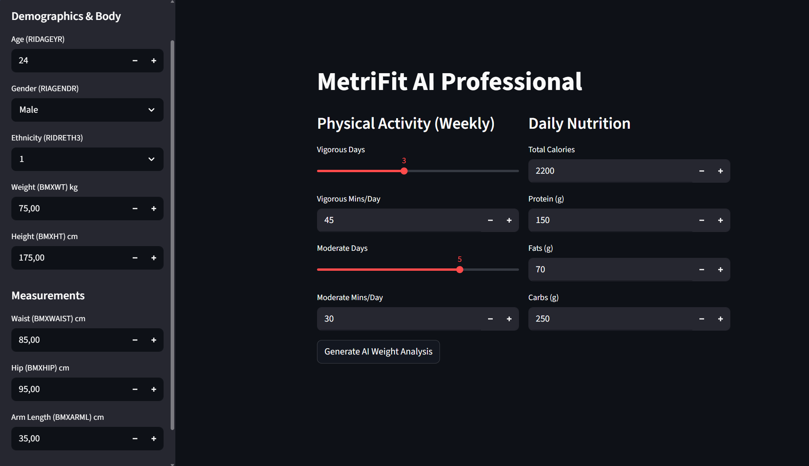
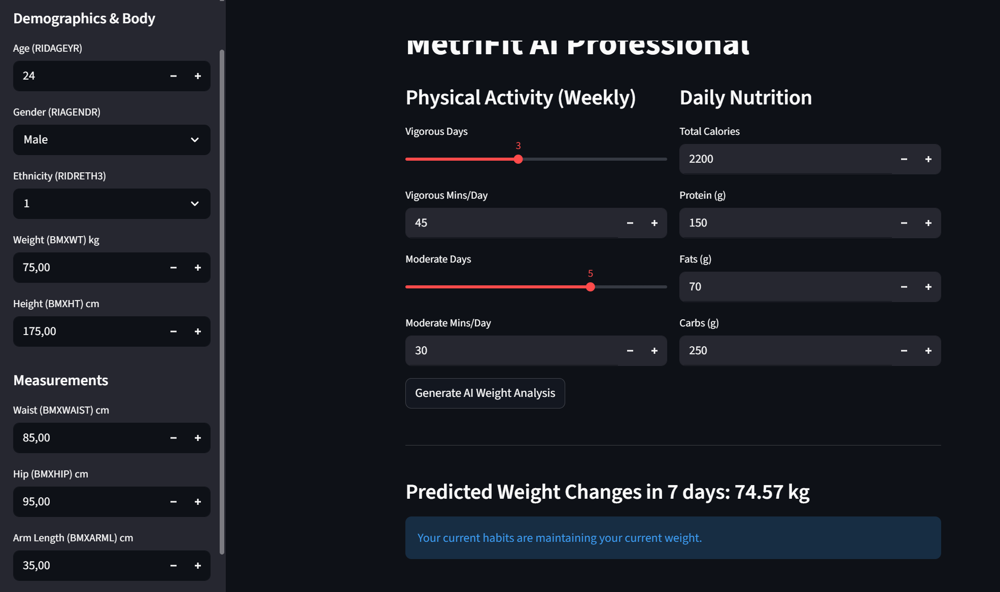

🏋️‍♂️ It-Fitness: Predictive Body Composition & Energy Analysis
It-Fitness is a machine learning-powered health platform that predicts body weight changes and metabolic trends using the NHANES (National Health and Nutrition Examination Survey) dataset. Unlike standard calculators, this model utilizes high-dimensional physiological and dietary data to provide personalized health insights.

🚀 Key Features
Predictive Modeling: Uses XGBoost and Linear Regression to forecast weight trends based on 29 distinct features.

MET-Based Activity Analysis: Implements WHO-standardized Metabolic Equivalent of Task (MET) calculations from NHANES PAQ data.

Automated Feature Engineering: Dynamically calculates BMR (Mifflin-St Jeor), TDEE, and Caloric Surplus/Deficit.

Interactive Streamlit Dashboard: A user-friendly interface for real-time predictions and nutritional "what-if" scenarios.

📊 The Data Pipeline
The project utilizes a multi-stage pipeline to transform raw CDC survey data into a production-ready model.

1. Data Cleaning & Integration
Sources: Merged Demographics (DEMO), Body Measures (BMX), Dietary Intake (DR1TOT), and Physical Activity (PAQ) files.

Imputation Strategy: Employed SimpleImputer with a median strategy for body measurements and most_frequent for categorical data to maintain biological integrity.

Outlier Management: Filtered survey-specific codes (e.g., 7777/9999) and handled biological outliers in caloric reporting.

2. Feature Engineering
Metabolic Metrics: Calculated Total MET-minutes/week to quantify activity intensity beyond simple sedentary time.

Energy Balance: Derived sur_def (Surplus/Deficit) by comparing reported intake against calculated TDEE.

Log Transformation: Applied np.log1p to skewed dietary features (Sugar, Fiber, Fat) to normalize distributions for the model.

🤖 Modeling & Performance
I evaluated multiple architectures to find the optimal balance between interpretability and predictive power.

Note on Model Selection: While XGBoost is highly robust, the strong linear relationship between physiological features (Height/Waist) and Weight allowed Linear Regression to perform exceptionally well as a baseline.

🛠️ Tech Stack
Languages: Python (Pandas, NumPy)

ML Frameworks: Scikit-Learn, XGBoost

Visualization: Matplotlib, Seaborn

Deployment: Streamlit, Joblib

Version Control: Git (Feature Branching Workflow)

📂 Project Structure

it-fitness/
├── data/
│   └── processed/       # Scaled NumPy arrays & cleaned CSVs
├── notebooks/
│   ├── 01_preprocessing.ipynb      # EDA & Feature Engineering
│   ├── 02_model.ipynb      # Model training & Hyperparameter tuning
├── models/
│   ├── preprocessor.pkl       # Saved ColumnTransformer
│   └── xgb_model.pkl          # Trained XGBoost model
|   └── linearreg.pkl          # Trained Linear Regression model
├── app/
│   └── streamlit_app.py           # Streamlit Application
└── README.md

🏃‍♂️ How to Run Locally
Clone the repository:
git clone https://github.com/yourusername/metrifit-ai.git

Install dependencies:
pip install -r requirements.txt

Launch the app:
streamlit run streamlit_app.py

👤 Author
Aruzhan Amangazy 
Sophomore Data Science Student @ CUHK-Shenzhen Specializing in Big Data Technology & Finance.
